# SDR 101
> By Siddharth Balyan 🥸

---
### Lecture Flow:
1. Intro to Radio Communication
2. What is a Software Defined Radio?
3. How does a Software Defined Radio Work?
4. SDR Hardware and Tools
5. Demonstrations
6. SDR in security
---
### Intro to Radio Communication 📻

> We already know what it is but for the sake of continuity...
- Radio waves = 30 Hz < EM Waves < 300 GHz.
- Communication possible through `Rx` and `Tx`.

---
#### Transmitter: 📶
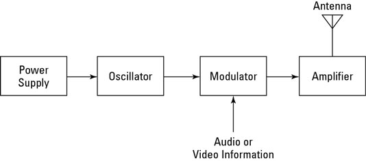

#### Reciever: 📶
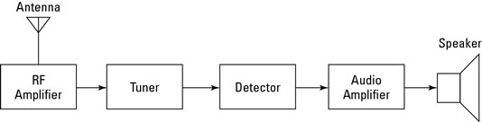

---
### Basic working of Radio 
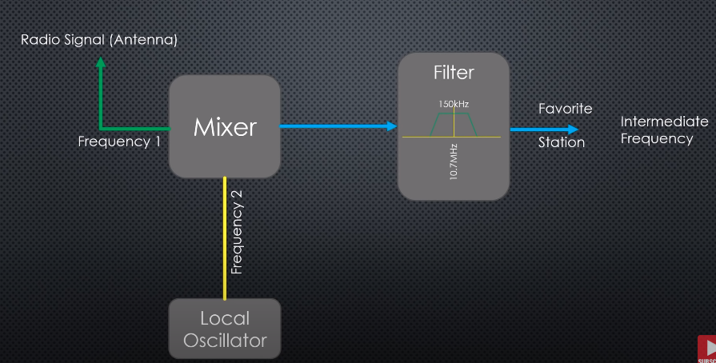

---
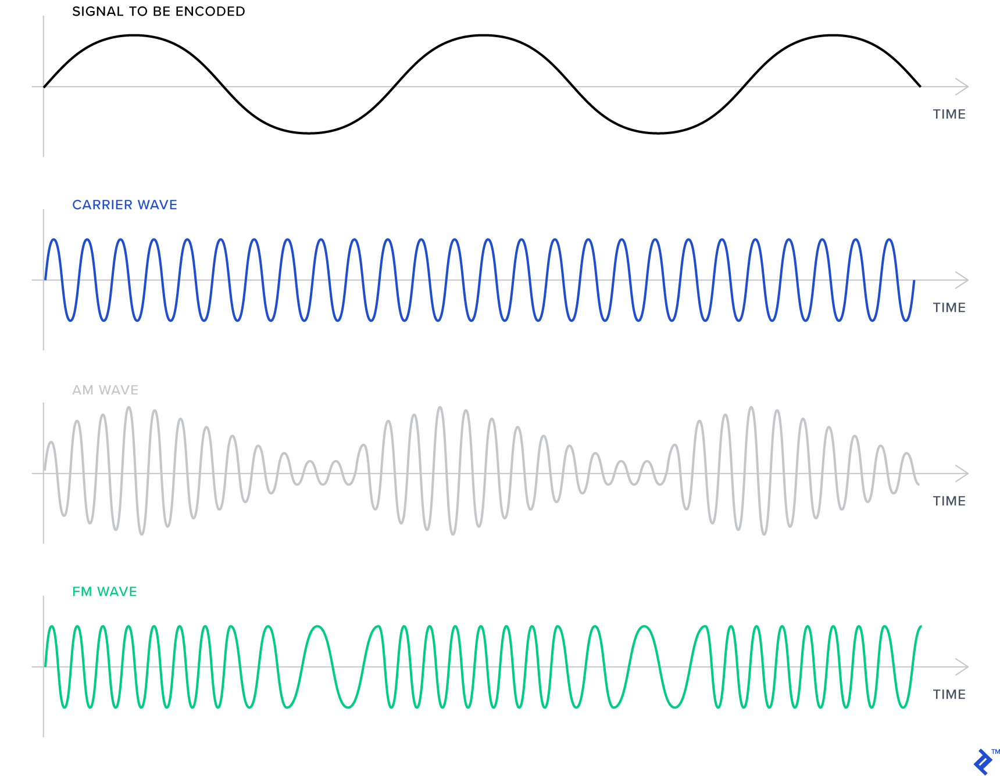

---

### What is a Software Defined Radio? 🧑🏿‍💻
Implementation of hardware components into software.

**Wireless + Digital = Software Defined Radio**
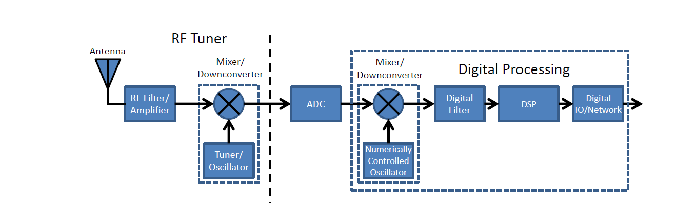

---

#### What does that mean?
It means that instead of turning around all those dials and turners to set the parameters of the radio communication like;
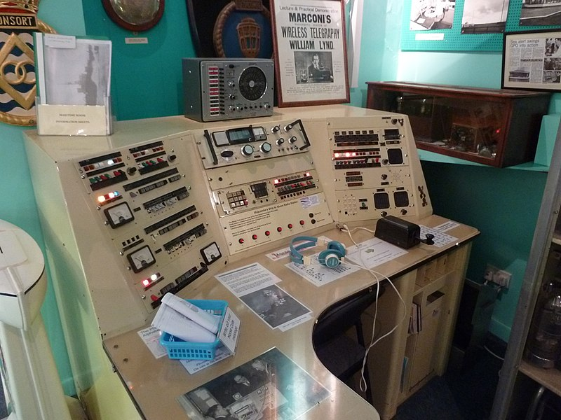 

---
...You can just do it on your computer system like

![]./../Attachments/Pasted image 20201108151653.png) 

---

#### What kind of hardware is implemented? 🤷‍♂️
Hardware which, in a traditional radio would have processed the signal now work as software components. This would include;

---

**Filters**
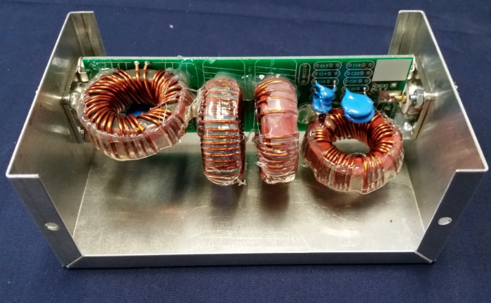

---
**Amplifiers**
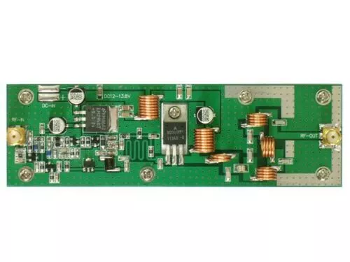

---
**Modulators and Demodulators**
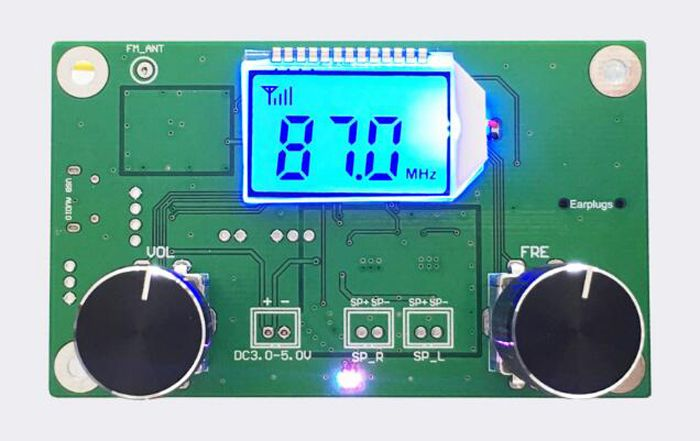

---
#### So this means...
Most modern radios you use and interact with are Software Defined Radios
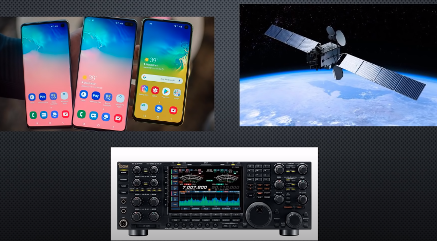

---
### How does it work?
#### The too long; 😴 didn't read version

- PHYSICS AND MATHS!!! ☠️☠️

---

#### The *bit more in-depth* version

- PHYSICS AND COMPLEX MATHS!!! 🤡🤡

---

#### The *extremely complicated* version
- The waves (sine) not represented by 2-D diagram, instead it is given a phase component
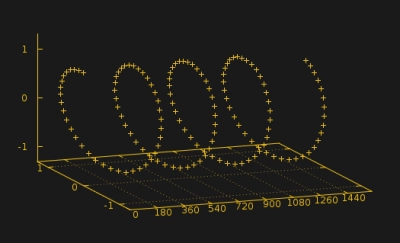

---

- Signal components named as I and Q waves
- These signals are converted and mixed as I/Q signal and outputted
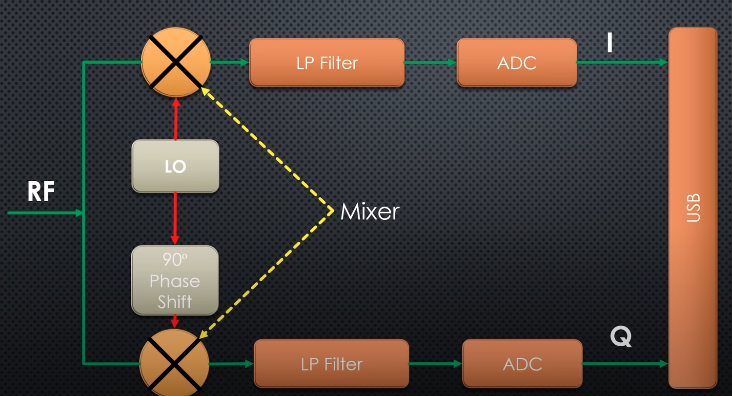

---

#### Complicated? 
It IS!
But there's no need to worry as we just work upon the other end of the SDR interface using different tools.

---
### SDR Hardware
#### RTL SDR 
- Cheap USB dongle capable of receiveing signals from 500kHZ to 1.75GHz.
- Based on Realtek RT2832U chipset 
 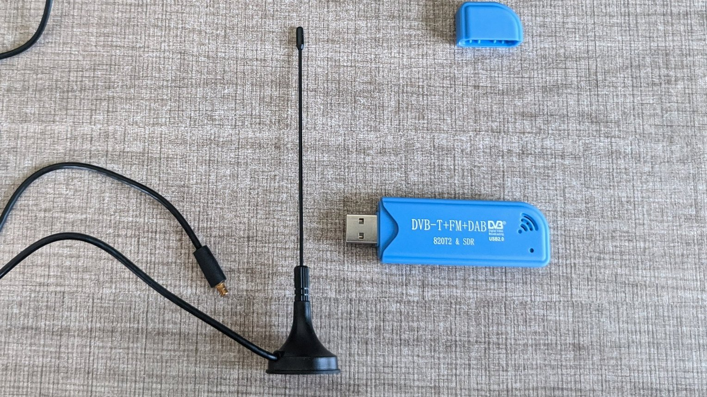

---

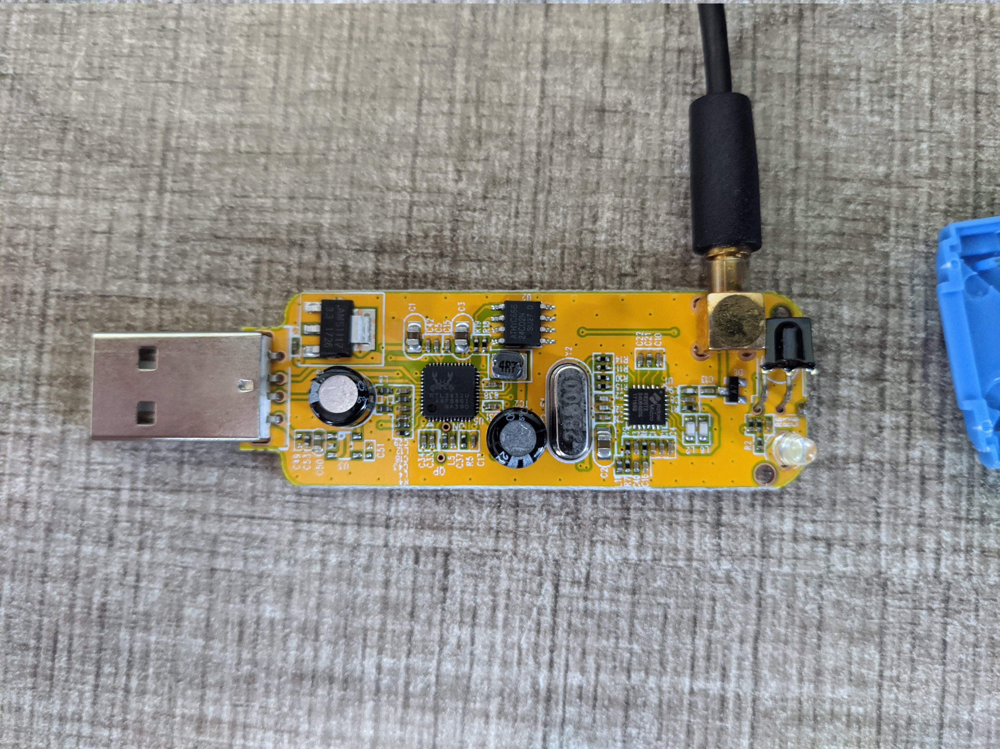

---
#### HackRF
- Open source SDR Board with Rx and Tx capabilities
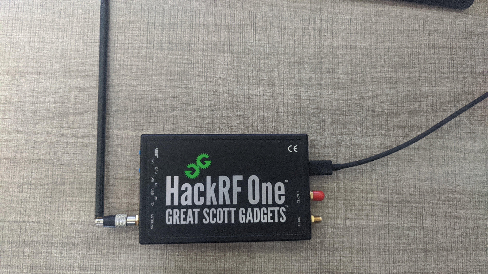

---
### SDR Tools
Some common SDR tools include:

---

#### GNU Radio
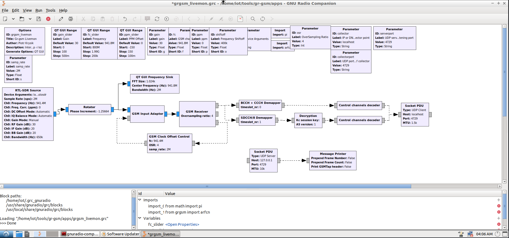

---
#### gqrx
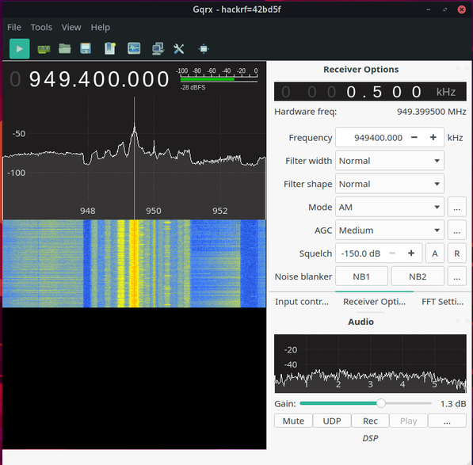

---
#### Universal Radio Hacker
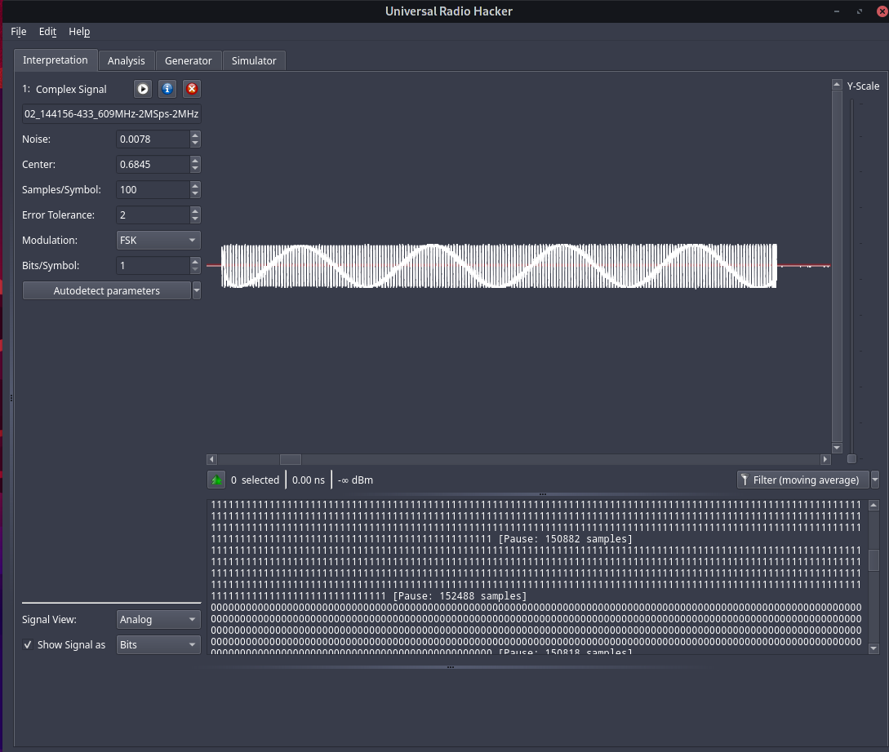

---
#### Dragon OS
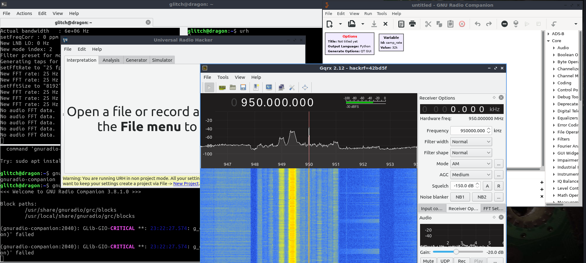

---
...and
- **QTRadio**
- **kalibrate-hackrf / kalibrate-rtl toolkit**
- **rtl toolkit**

---
### Lecture Over, Demonstration Time! 👨🏽‍💻
Now to showcase some of these tools and demo some cool SDR uses

---
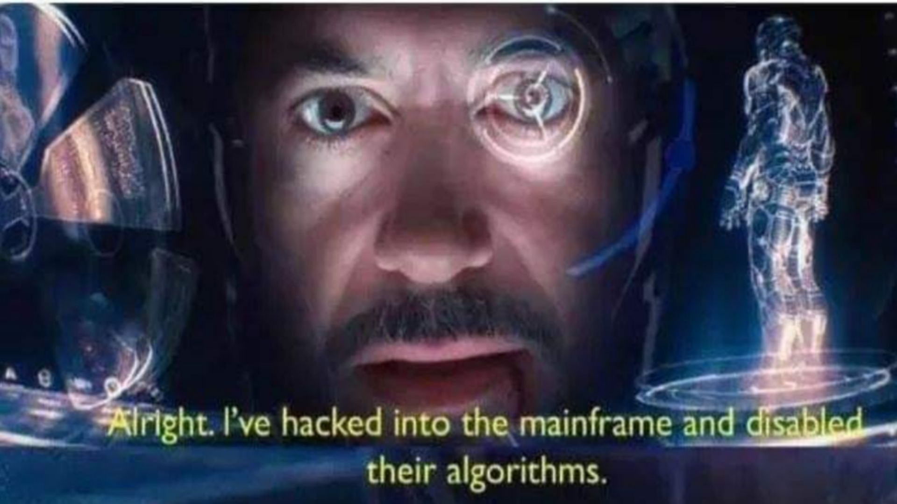

---
### Demo #1: Listening to 93.5 RED FM 📻
- We use `gqrx` and RTL-SDR to manually tune into 95.3 MHz

---
### Demo #2: [WebSDR](http://69.27.184.62:8901/)
- Listening to US Communications 😎😎😎

---
### Demo #3: Capturing the car key fob signal 🚗
- We use `Universal Radio Hacker` to capture and understand the car key signal 

---
### Demo #4: Using your phone with RTl-SDR
- We use the Android port of `rtl-sdr` driver toolkit and an SDR listener to create our own portable SDR spectrum tuner

---
### Demo #5: Sniffing GSM and Cellular Data 📱📶
- Here we shall use `gr-gsm` tools based on GNU Radio along with `wireshark` to sniff GSM Data.

---
### SDR in Security
As we've seen through the demonstrations, SDR is no longer a tool of a radio enthusiast but an important domain with which we can analyze and secure the vast domain or wireless communication around us.

---
# Thanks! 🙏

---

